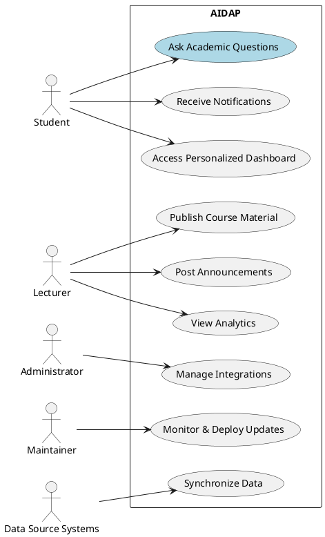
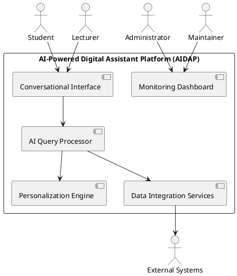

# AI-Powered Digital Assistant Platform (AIDAP)

## 1. Business Case

The **AI-Powered Digital Assistant Platform (AIDAP)** is a conversational AI system designed to enhance access to academic and institutional information for students, lecturers, and administrators. The system integrates with existing university services such as the Learning Management System (LMS), registration databases, calendars, and email servers to provide contextual, personalized responses to queries.

**Key goals:**

- Improve information accessibility and reduce administrative overhead.
- Deliver personalized insights (e.g., deadlines, grades, events) via chat or voice.
- Support both web and mobile platforms with 99.5% availability.
- Ensure compliance with institutional privacy and security standards.

The business value lies in streamlining academic interactions, increasing operational efficiency, and improving the student and faculty experience through intelligent automation.

---

## 2. Stakeholders and System Overview

| Symbol | Stakeholder         | Description                                                              |
| ------ | ------------------- | ------------------------------------------------------------------------ |
| **S**  | Students            | End users who query academic and campus information.                     |
| **L**  | Lecturers           | Provide course-related content and respond to academic queries.          |
| **A**  | Administrators      | Maintain institutional data, integrations, and policies.                 |
| **M**  | System Maintainer   | Responsible for deployment, monitoring, and upgrades.                    |
| **D**  | Data Source Systems | External systems such as LMS, registration, calendar, and email servers. |

---

## 3. Use Case Model

### 3.1 Use Case Diagram

### 3.2 Use Case Descriptions

| Use Case                      | ID Reference  | Description                                                | Primary Actor       |
| ----------------------------- | ------------- | ---------------------------------------------------------- | ------------------- |
| Ask Academic Questions        | RS1, R1, R5   | Student queries AIDAP for schedule, grades, or exam dates. | Student             |
| Receive Notifications         | RS2, RS13     | System sends alerts for announcements or due dates.        | Student             |
| Access Personalized Dashboard | RS3, RS5      | Students view upcoming deadlines, grades, and events.      | Student             |
| Publish Course Material       | RL1           | Lecturers upload or update course files via the assistant. | Lecturer            |
| Post Announcements            | RL2, RS2      | Lecturers broadcast messages to students.                  | Lecturer            |
| View Analytics                | RL3, RL6      | View attendance, grades, and engagement summaries.         | Lecturer            |
| Manage Integrations           | RA1, RA2      | Admin configures LMS, registration, and calendar links.    | Administrator       |
| Monitor & Deploy Updates      | RM1, RM2      | Maintainers monitor performance and deploy updates.        | Maintainer          |
| Synchronize Data              | RD1, RD2, RD3 | Data from external systems synchronized periodically.      | Data Source Systems |

---

## 4. Quality Attributes

| Attribute                     | Description                                     | Requirement ID | Example Measure/Scenario                                 |
| ----------------------------- | ----------------------------------------------- | -------------- | -------------------------------------------------------- |
| **Performance**               | Responses must be processed quickly.            | RS10           | Average response time ≤ 2s under normal load.            |
| **Availability**              | Service must remain accessible.                 | RS11, RA6      | 99.5% uptime per month with failover.                    |
| **Scalability**               | System must handle growth and spikes.           | RA7            | Up to 5,000 concurrent users.                            |
| **Security**                  | Protect user data and ensure secure access.     | RS7, RA5, RM7  | Single sign-on (SSO), encryption, and role-based access. |
| **Usability**                 | Interface must be intuitive and accessible.     | RS12           | Conversational UI meets accessibility standards.         |
| **Modifiability**             | Easy integration of new AI models or APIs.      | RM5            | Modular microservice design.                             |
| **Interoperability**          | Works with LMS, registration, and email.        | R3, RD2        | REST/GraphQL API interfaces.                             |
| **Reliability**               | Handles network or service failures gracefully. | RD3            | Automatic retries and recovery.                          |
| **Learnability/Adaptability** | Improves response relevance over time.          | RS5            | Adaptive AI model based on historical data.              |

### 4.1 Quality Attribute Scenarios

| ID      | Attribute     | Scenario                                                                                            | Associated Use Case |
| ------- | ------------- | --------------------------------------------------------------------------------------------------- | ------------------- |
| **QA1** | Performance   | Under peak load (5,000 users), 95% of queries are answered within 2 seconds.                        | RS10                |
| **QA2** | Availability  | During a service failure, system restores full operation within 60 seconds.                         | RA6                 |
| **QA3** | Security      | Unauthorized users cannot access private student data; all access is logged.                        | RS7, RA5            |
| **QA4** | Modifiability | Adding a new AI service requires no downtime.                                                       | RM1, RM5            |
| **QA5** | Usability     | The chatbot UI can respond to a query in natural language and provide a clear menu of next options. | RS12                |
| **QA6** | Reliability   | If LMS connection fails, AIDAP retries within 5 seconds and logs an alert.                          | RD3                 |

---

## 5. System Constraints

| ID      | Constraint             | Description                                                    |
| ------- | ---------------------- | -------------------------------------------------------------- |
| **C1**  | Cloud Deployment       | Must be cloud-native and support container orchestration (R7). |
| **C2**  | Privacy Compliance     | Must comply with institutional privacy policies (R8, RA5).     |
| **C3**  | Integration Standards  | Use REST/GraphQL for interoperability (RD2).                   |
| **C4**  | Authentication         | Use institutional single sign-on (RS7).                        |
| **C5**  | Platform Accessibility | Web, mobile, and voice-compatible (RS9).                       |
| **C6**  | Multi-language Support | Handle multiple languages in UI and voice (RS4).               |
| **C7**  | Response Time          | ≤ 2 seconds average response time (RS10).                      |
| **C8**  | Availability           | Maintain uptime of at least 99.5% monthly (RS11).              |
| **C9**  | Scalability            | Support 5,000+ concurrent users (RA7).                         |
| **C10** | Backup and Recovery    | Enable automatic failover and data restore (RA6, RM6).         |

---

## 6. Architectural Concerns

| ID      | Concern                   | Description                                                     |
| ------- | ------------------------- | --------------------------------------------------------------- |
| **AC1** | Data Synchronization      | Maintain consistency between AIDAP and external systems.        |
| **AC2** | AI Model Lifecycle        | Update AI models without downtime (RM1, RM3).                   |
| **AC3** | Security & Access Control | Enforce privacy, role-based permissions, and audit logging.     |
| **AC4** | Extensibility             | Add new AI modules or third-party integrations easily (RM5).    |
| **AC5** | Monitoring & Logging      | Track latency, accuracy, and system health (RM2, RM4).          |
| **AC6** | User Experience           | Maintain natural dialogue flow and responsive interface (RS12). |
| **AC7** | Offline Operation         | Cache recent responses for offline use (RS14).                  |
| **AC8** | Compliance & Governance   | Adhere to institutional and legal data regulations (R8, RA5).   |

---

## 7. Stakeholder Context Diagram

---

### **End of Deliverable 1**

**Next Phase:** ADD Iterations 1 & 2 – Architectural design and framework selection (Due: Nov. 16, 2025).
