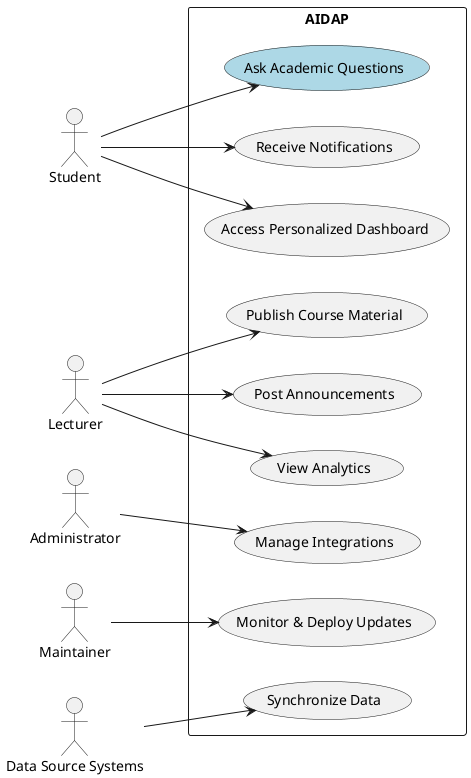
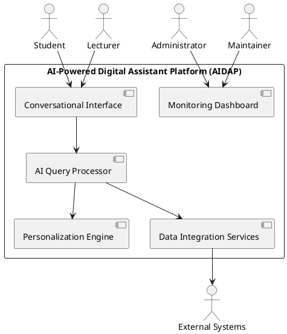

## Business Case

The **AI-Powered Digital Assistant Platform (AIDAP)** is a conversational AI system designed to enhance access to academic and institutional information for students, lecturers, and administrators. The system integrates with existing university services such as the Learning Management System (LMS), registration databases, calendars, and email servers to provide contextual, personalized responses to queries.

**Key goals:**

- Improve information accessibility and reduce administrative overhead.
- Deliver personalized insights (e.g., deadlines, grades, events) via chat or voice.
- Support both web and mobile platforms with 99.5% availability.
- Ensure compliance with institutional privacy and security standards.

The business value lies in streamlining academic interactions, increasing operational efficiency, and improving the student and faculty experience through intelligent automation.

---

## Stakeholders and System Overview

| Symbol | Stakeholder         | Description                                                              |
| ------ | ------------------- | ------------------------------------------------------------------------ |
| **S**  | Students            | End users who query academic and campus information.                     |
| **L**  | Lecturers           | Provide course-related content and respond to academic queries.          |
| **A**  | Administrators      | Maintain institutional data, integrations, and policies.                 |
| **M**  | System Maintainer   | Responsible for deployment, monitoring, and upgrades.                    |
| **D**  | Data Source Systems | External systems such as LMS, registration, calendar, and email servers. |

---

## Use Case Model

### Use Case Diagram

### Use Case Descriptions

| Use Case                      | ID Reference  | Description                                                | Primary Actor       |
| ----------------------------- | ------------- | ---------------------------------------------------------- | ------------------- |
| Ask Academic Questions        | RS1, R1, R5   | Student queries AIDAP for schedule, grades, or exam dates. | Student             |
| Receive Notifications         | RS2, RS13     | System sends alerts for announcements or due dates.        | Student             |
| Access Personalized Dashboard | RS3, RS5      | Students view upcoming deadlines, grades, and events.      | Student             |
| Publish Course Material       | RL1           | Lecturers upload or update course files via the assistant. | Lecturer            |
| Post Announcements            | RL2, RS2      | Lecturers broadcast messages to students.                  | Lecturer            |
| View Analytics                | RL3, RL6      | View attendance, grades, and engagement summaries.         | Lecturer            |
| Manage Integrations           | RA1, RA2      | Admin configures LMS, registration, and calendar links.    | Administrator       |
| Monitor & Deploy Updates      | RM1, RM2      | Maintainers monitor performance and deploy updates.        | Maintainer          |
| Synchronize Data              | RD1, RD2, RD3 | Data from external systems synchronized periodically.      | Data Source Systems |

---

## Stakeholder Context Diagram

---

